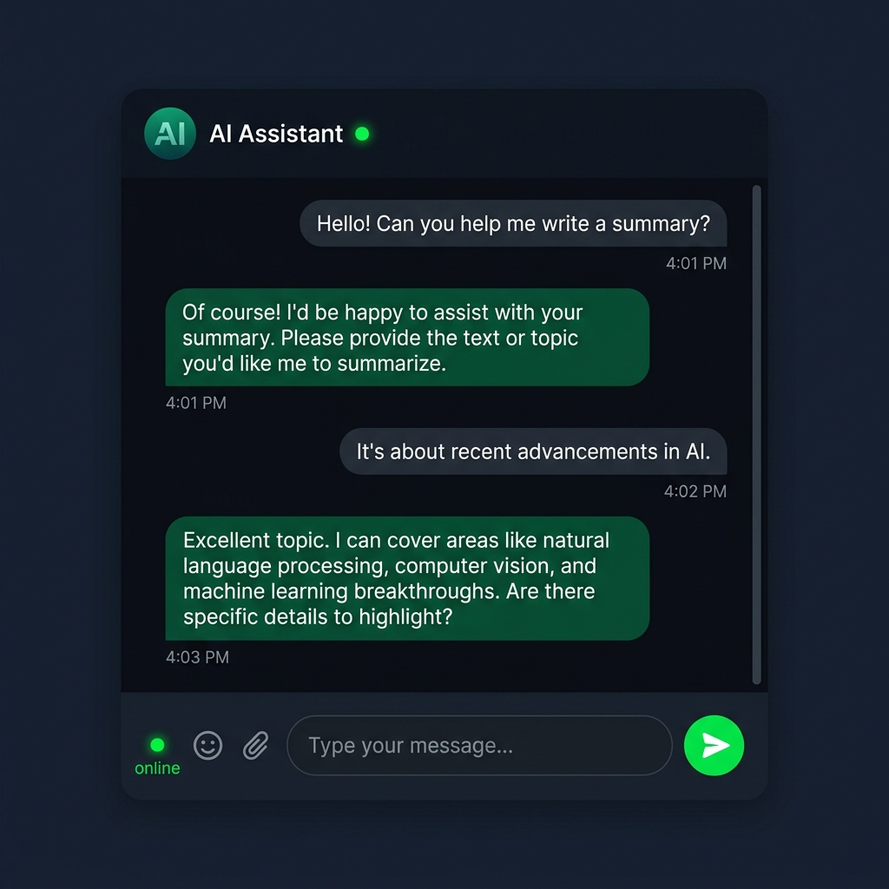

# ChatBotPro 🤖

Hey! 👋 This is ChatBotPro, a lightweight AI-powered chat interface I built to learn about API integrations, styling clean chat bubbles, and handling dynamic conversation flows in React.

## 📸 Preview

## Why I built this
I wanted to build a simple, responsive AI chat client that feels like a real desktop application. Designing message streams and managing chat states (like keeping the container scrolled to the bottom as new messages print) was harder than I expected! I also used this project to learn about handling secrets on the backend so API keys aren't exposed to the client.

## Features
- Real-time simulated AI chat dialogue
- Modern conversational interface with green/emerald accents
- Scroll-locking to auto-scroll new messages into view
- Fully responsive layout for mobile and desktop

## Tech Stack
- **Frontend:** React, HTML5, CSS3, JavaScript (ES6+)
- **Backend:** Node.js, Express (for proxying requests securely)
- **Styling:** Custom CSS animations and transitions

## Known Issues (// TODOs)
- **Streaming Responses:** Currently the bot responds all at once. I want to update this to stream responses word-by-word like ChatGPT.
- **User Authentication:** No login system right now; everyone gets a fresh temporary session.
- **Theme Selection:** Adding a dark/light switcher or custom accent colors.

## Setup Instructions

If you want to run this locally:

1. Clone this repository
2. Open `chatbotpro-backend`, install dependencies with `npm install`
3. Set up your API credentials in a `.env` file in the backend folder
4. Open `chatbotpro-frontend` and run `npm install`
5. Run `npm run dev` in both folders and go to `http://localhost:5173`

Cheers! ✌️
